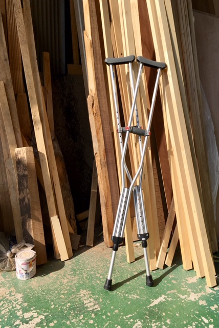
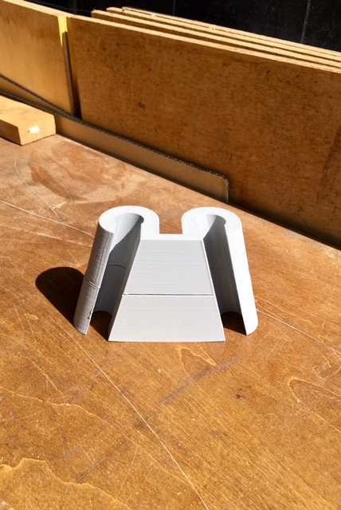
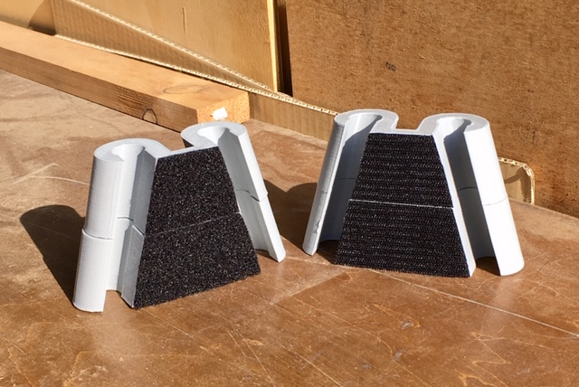
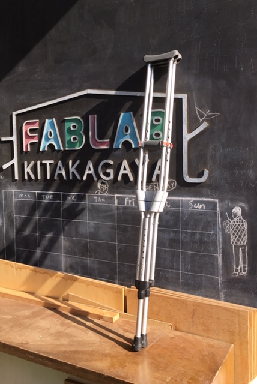
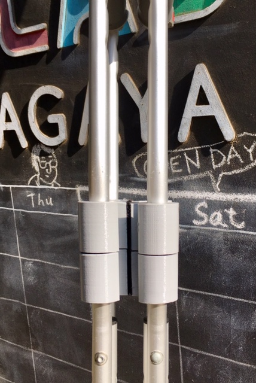

# 松葉杖束ね具(Cruches Binder)

2本の松葉杖を軽くつなげるツール  
Tool to bind two crutches lightly  


## Background & Goal

松葉杖を使っていると、電車やバスに座るときに脇に杖を置くことになる。  
この2本の杖がばらけがちで、ちょっと困る。  

  

簡単にまとめる道具があれば良い(紐で結ぶような一手間も省略したい)。  
2本をまとめて片松葉杖にするときも便利。  
杖をそろえるだけで、ベルクロ(マジックテープ)で接続できるアタッチメントを作る。  


#### 取り付ける杖  
TOYO BB-AB  
パイプ直径 18.5mm (実測)  
パイプがなす角 約30° (実測)  


## Instruction

#### 1. crutches_binderを出力する  

3Dプリンタで部品を出力する(*crutches_binder*)。
大きければ2分割したファイル (*crutches_binder(upper)*, *crutches_binder(lower)*) を使う。  

  

([FabLab KITAKAGAYA](fablabkitakagaya.org)で出力しました)  

#### 2. ベルクロ(マジックテープ)を入手する   

100均でも売っています。   
粘着テープ付が便利。  

#### 3. ベルクロ(マジックテープ)を貼る  

  

剥がれたら、強力な接着剤で貼り直す。  
貼り付け前に部品の接着面をやすりがけすると、よりしっかりつくかもしれません。  
(へたってきたら、必要に応じてベルクロを交換する。)  

#### 4. 杖に取り付ける  

  
  


#### 5. 使用に支障がないか慎重に検討する

安全確認を十全に。  
理学療法士などの指示に従うこと。  


## Licenses and Credits  


<a rel="license" href="http://creativecommons.org/licenses/by-sa/4.0/"></a><br />松葉杖束ね具(Cruches Binder) (stlデータおよび本ドキュメント)Produced by yosukesakai は <a rel="license" href="http://creativecommons.org/licenses/by-sa/4.0/">クリエイティブ・コモンズ 表示 - 継承 4.0 国際 ライセンス</a>の下に提供されています。  

松葉杖束ね具(Cruches Binder) (stl data and this document) Produced by yosukesakai is licensed under a <a rel="license" href="http://creativecommons.org/licenses/by-sa/4.0/">Creative Commons Attribution - ShareAlike 4.0 License</a>.  


##Disclaimer

```
yosukesakaiはあなたに対し、本作品(3Dモデルデータおよびドキュメントを含む)に関し、何らの保証もいたしません。
本サイトの関係者（他の利用者も含む）は、本作品(3Dモデルデータおよびドキュメントを含む)の利用（閲覧、投稿、外部での再利用など一切の利用を含むものとします。以下同じ）に関し、あなたに対して一切責任を負いません。
あなたが、本作品(3Dモデルデータおよびドキュメントを含む)を利用する場合は、自己責任で行う必要があります。
yosukesakaiは、あなたに対し、本作品(3Dモデルデータおよびドキュメントを含む)の利用の結果生じた損害について、一切責任を負いません。
yosukesakaiは、あなたの適用される法令に照らして、本作品(3Dモデルデータおよびドキュメントを含む)の利用が合法であることを保証しません。
コンテンツとして提供する全ての情報について、内容の合法性・正確性・安全性等、あらゆる点において保証しません。
また、リンクをしている外部サイトについては、何ら保証しません。
本作品(3Dモデルデータおよびドキュメントを含む)は、Creative Commons Attribution-ShareAlike 4.0 International Licenseに基づく改変・再利用を許諾しますが、
法令その他の法慣習に反する形での利用を許諾するものではありません。
文章と共に表示されている画像は、それぞれ文章とは別個のライセンスに基づく場合があります。
yosukesakaiは、事前の予告無く、本作品(3Dモデルデータおよびドキュメントを含む)のほか全部または一部のコンテンツの提供を中止する可能性があります。
```

```
yosukesakai makes no guarantees whatsoever related to this work (including 3D model data or document).
The persons involved in the creation/operation of this website (including other users) take no responsibility regarding 
the usage of this work (including 3D model data or document) (including any kind of use such as browsing, contribution, or external re-use; 
the same shall apply hereinafter).
When using this work (including 3D model data or document), you are required to take personal responsibility. 
yosukesakai takes no responsibility regarding eventual damage resulting from your use of this work (including 3D model data or document).
yosukesakai does not guarantee that your use of this work (including 3D model data or document) is legitimate according to applicable laws.
We don't guarantee in any way the legitimacy, accuracy and safety of all information provided as contents.
We make no guarantees regarding external website linked to from this site.
This work (including 3D model data or document) permits alteration or reuse based on the Creative Commons Attribution-ShareAlike 3.0 Unported License, 
however it does not permit forms of reuse that violate laws or other regulations.  
The use of images accompanying the text may be based on license agreements separate from the respective text licenses.  
yosukesakai may discontinue the publication of all or parts of this work (including 3D model data or document) and all other contents without prior notice.
```

-------

###memo  

##### Repricator 2X でPLAを使う  

PLA : WANHAO 1.75mm  
estruder temp：190  
platform temp：100  
ドアを開け、前面から扇風機で冷却  

結果: 一部platformから剥がれあり  


##### 素材、構造の選定  
磁石やスライド構造も検討したが、より費用を抑えられて単純なベルクロを採用した  

